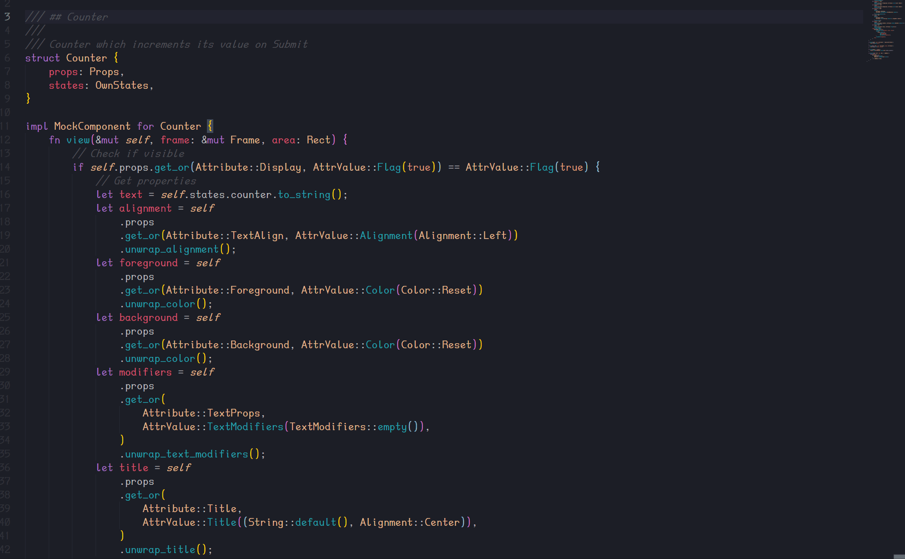

# tui-realm

<p align="center">
  
</p>

<p align="center">~ A tui-rs framework inspired by Elm and React ~</p>
<p align="center">
  <a href="/docs/get-started.md" target="_blank">Get started</a>
  ·
  <a href="https://github.com/veeso/tui-realm-stdlib" target="_blank">Standard Library</a>
  ·
  <a href="https://docs.rs/tuirealm" target="_blank">Documentation</a>
</p>

<p align="center">Developed by <a href="https://veeso.github.io/" target="_blank">@veeso</a></p>
<p align="center">Current version: 1.0.0 (FIXME:/10/2021)</p>

<p align="center">
  <a href="https://opensource.org/licenses/MIT"
    ></a>
  <a href="https://github.com/veeso/tui-realm/stargazers"
    ></a>
  <a href="https://crates.io/crates/tuirealm"
    ></a>
  <a href="https://crates.io/crates/tuirealm"
    ></a>
  <a href="https://www.buymeacoffee.com/veeso">
    </a>
</p>
<p align="center">
  <a href="https://github.com/veeso/tui-realm/actions"
    ></a>
  <a href="https://github.com/veeso/tui-realm/actions"
    ></a>
  <a href="https://github.com/veeso/tui-realm/actions"
    ></a>
  <a href="https://coveralls.io/github/veeso/tui-realm"
    ></a>
  <a href="https://docs.rs/tuirealm"
    ></a>
</p>

---

- [tui-realm](#tui-realm)
  - [About tui-realm 👑](#about-tui-realm-)
  - [Get started 🏁](#get-started-)
    - [Add tui-realm to your Cargo.toml 🦀](#add-tui-realm-to-your-cargotoml-)
    - [Create a tui-realm application](#create-a-tui-realm-application)
    - [Run examples](#run-examples)
  - [Standard components library 🎨](#standard-components-library-)
  - [Community components 🏘️](#community-components-️)
  - [Guides 🎓](#guides-)
  - [Documentation 📚](#documentation-)
  - [About other backends](#about-other-backends)
  - [Apps using tui-realm 🚀](#apps-using-tui-realm-)
  - [Contributing and issues 🤝🏻](#contributing-and-issues-)
  - [Changelog ⏳](#changelog-)
  - [Buy me a coffee ☕](#buy-me-a-coffee-)
  - [License 📃](#license-)

---

## About tui-realm 👑

tui-realm is a **framework** for [tui](https://github.com/fdehau/tui-rs) to simplify the implementation of terminal user interfaces adding the possibility to work with re-usable components with properties and states, as you'd do in React But that's not all: the components communicate with the ui engine via a system based on **Messages** and events, providing you with the possibility to implement `update` functions as happens in Elm. In addition, the components are organized inside **Views**, which manages mounting/umounting and focus for you.

And that's also explains the reason of the name: Realm stands for React and Elm.

Tui-realm also comes with a standard library of components, which can be added to your dependencies, that you may find very useful. Don't worry, they are optional if you don't want to use them 😉, just follow the guide in [get started](#get-started-).



---

## Get started 🏁

⚠ Warning: tui-realm works only with **crossterm** as backend ⚠

### Add tui-realm to your Cargo.toml 🦀

```toml
tuirealm = "0.6.0"
```

Since this library requires `crossterm` too, you'll also need to add it to your Cargo.toml

```toml
crossterm = "0.20"
```

You don't need tui as dependency, since you can access to tui via `tuirealm::tui::*`

### Create a tui-realm application

View how to implement a tui-realm application in the [related guide](docs/get-started.md).

### Run examples

Still confused about how tui-realm works? Don't worry, try with the examples:

- [demo](examples/demo.rs): a simple application which shows how tui-realm works

    ```sh
    cargo run --example demo
    ```

---

## Standard components library 🎨

Tui-realm comes with an optional standard library of components I thought would have been useful for most of the applications.
If you want to use it, just add the [tui-realm-stdlib](https://crates.io/crates/tui-realm-stdlib) to your `Cargo.toml` dependencies.

For each component, the standard library provides a `PropsBuilder` in the same module (e.g. `input::Input => input::InputPropsBuilder`), which provides methods to set only the properties actually used by the component.

## Community components 🏘️

These components are not included in tui-realm, but have been developed by other users. I like advertising other's contents, so here you can find a list of components you may find useful for your next tui-realm project 💜.

- [tui-realm-treeview](https://github.com/veeso/tui-realm-treeview) A treeview component developed by [@veeso](https://github.com/veeso)

Want to add yours? Open an issue using the `New app/component` template 😄

---

## Guides 🎓

- [Get Started Guide](docs/get-started.md)
- [The UI lifecycle](docs/lifecycle.md)
- [Implement components](docs/new-components.md)

---

## Documentation 📚

The developer documentation can be found on Rust Docs at <https://docs.rs/tuirealm>

---

## About other backends

As you've probably already noticed, tuirealm only supports `crossterm` as backend for the terminal, even if `tui` supports `termion` and other libraries. Why this?
Well the reasons are these two:

1. There's no reason to use the other backends: I use crossterm in termscp, and I don't find any advantage in using termion or other backends. Crossterm is cross platform and works perfectly fine.
2. Implementing the support for the other backends would force me in creating a mapper for input events from the different backends into a common type. Is it possible? Yes it is, but I'm really not interested in implementing it.

---

## Apps using tui-realm 🚀

- [termusic](https://github.com/tramhao/termusic)
- [termscp](https://github.com/veeso/termscp)

Want to add yours? Open an issue using the `New app/component` template 😄

---

## Contributing and issues 🤝🏻

Contributions, bug reports, new features and questions are welcome! 😉
If you have any question or concern, or you want to suggest a new feature, or you want just want to improve tui-realm, feel free to open an issue or a PR.

Please follow [our contributing guidelines](CONTRIBUTING.md)

---

## Changelog ⏳

View tui-realm's changelog [HERE](CHANGELOG.md)

---

## Buy me a coffee ☕

If you like tui-realm and you're grateful for the work I've done, please consider a little donation 🥳

[](https://www.buymeacoffee.com/veeso)

or you can also directly make a donation on PayPal:

[](https://www.paypal.me/chrisintin)

---

## License 📃

tui-realm is licensed under the MIT license.

You can read the entire license [HERE](LICENSE)
